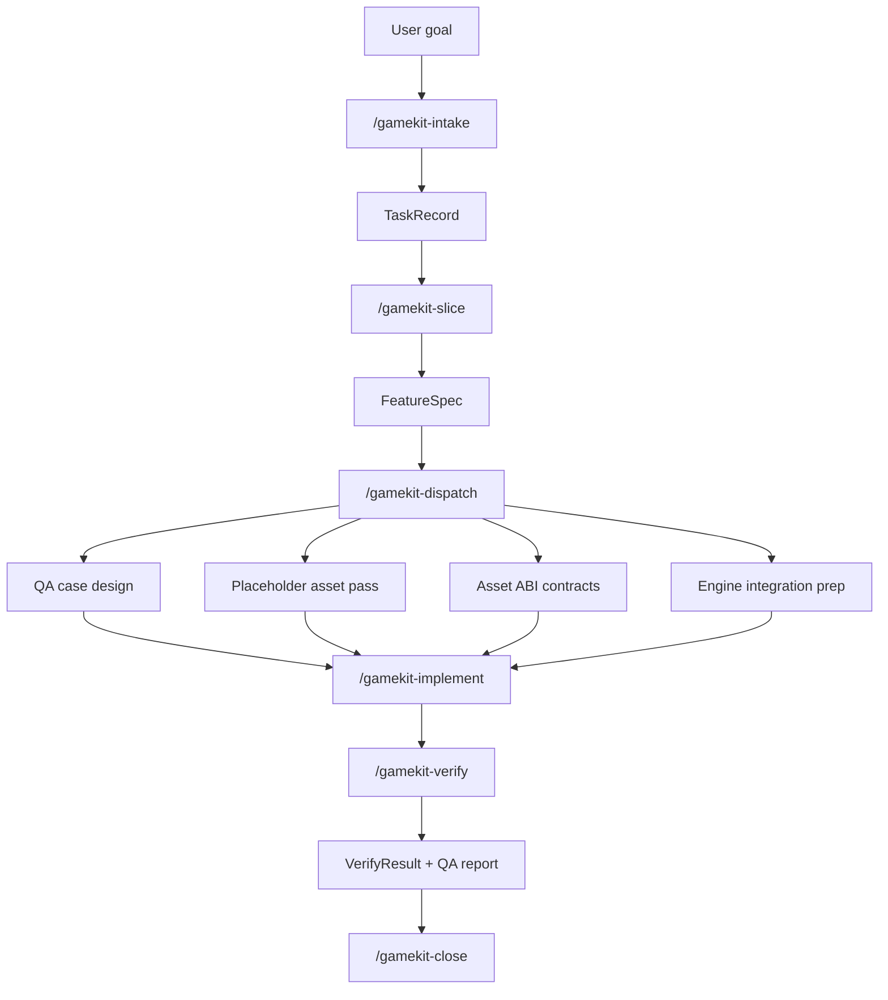

# Claude Agents GameKit


A Claude Code multi-agent template for 3D game development across Unity, Godot, web, and WeChat Mini Game projects.

This repository is built for a practical problem: most AI coding workflows break down in game projects because the work is noisy, asset-heavy, engine-specific, and too easy to derail with context sprawl. GameKit is designed to keep that under control.

- It keeps the main session as the single orchestrator.
- It pushes narrow, high-noise work into subagents.
- It separates human docs from machine-readable runtime state.
- It treats placeholder asset replacement as a first-class contract problem.
- It makes verification part of the workflow, not an afterthought.

If you want Claude Code to help with real game production work instead of isolated code snippets, this template is the starting point.

## Why This Exists

Game development is a poor fit for naive agent workflows.

Compared with ordinary application code, a game slice usually includes:

- design constraints
- placeholder or graybox art
- engine-specific setup
- implementation details
- QA and manual verification evidence
- future human replacement of temporary assets

When all of that is pushed through one long chat, the result is predictable:

- context becomes bloated
- the model confuses planning with implementation
- temporary assets get hardcoded into gameplay
- verification becomes vague
- later contributors cannot tell what is authoritative

This project is designed around that failure mode.

The template assumes that even a strong model benefits from narrower roles, and that a weaker or lower-context model benefits even more. The goal is not to create as many agents as possible. The goal is to create the minimum structure needed to keep a game workflow reviewable, restartable, and replaceable.

## Core Design Ideas

### 1. The main session is the orchestrator

GameKit does not build around free-form agent swarms.

The main Claude Code session acts as `gamekit-main-orchestrator`. It owns:

- task intake
- stage transitions
- subagent dispatch
- handoff review
- final closeout

Subagents do not coordinate directly with each other. This star topology is intentional.

Why:

- it reduces context drift
- it keeps ownership obvious
- it makes handoffs explicit
- it is easier to recover from interrupted sessions
- it works better with limited-context models

### 2. Split by context pollution, not by org chart

The template does not try to recreate a full studio org chart inside Claude Code.

Instead, it isolates the kinds of work that are most likely to blow up context:

- feature slicing
- placeholder asset composition
- asset replacement contracts
- engine-specific integration
- QA case design and verification
- script and workflow validation
- release and publication

This is why the roles are narrow. It is also why built-in Claude Code agents like `Explore` and `Plan` are still used for read-only discovery instead of cloning them into custom project agents.

### 3. Human docs and runtime state must be different things

This template enforces a split between:

- human-readable knowledge in `.claude-gamekit/project/docs/`
- machine-readable state in `.claude-gamekit/project/artifacts/`
- reusable toolkit logic in `.claude-gamekit/core/`

That split matters because game workflows need both:

- docs that humans can read quickly
- structured records that agents and scripts can validate reliably

If those are mixed together, the repository becomes harder to reuse and harder to verify.

### 4. Placeholder assets are treated as contracts

One of the most expensive mistakes in AI-assisted game workflows is letting temporary assets leak into permanent gameplay code.

GameKit avoids that by treating replaceable art as an Asset ABI problem.

Each replaceable asset can be described through a contract that captures:

- pivot rules
- scale rules
- socket definitions
- material slots
- collision assumptions
- prefab or node shape

The idea is simple:

- placeholder art should unblock development
- gameplay code should depend on contracts, not on temporary mesh names
- later human artists should be able to swap assets without breaking logic

That is why `gamekit-placeholder-artist` and `gamekit-tech-art-contracts` are separate roles.

### 5. Verification is part of the pipeline

This template assumes that not every engine can be fully executed in every environment.

For example, Unity may not be available locally. That does not mean verification disappears. It means verification must degrade in a controlled, explicit way.

GameKit makes verification a first-class output through:

- QA case authoring before implementation
- structured verification artifacts
- capability matrices per engine
- CI-required or blocked states when local execution is not possible

The workflow does not treat "I could not run it" as a complete answer.

## What Makes This Repository Different

Most "AI game dev templates" stop at prompts or role descriptions.

This repository goes further:

- custom Claude Code agents are already wired
- namespaced slash commands are included
- hooks are configured
- scripts are runnable from Node
- schema validation is built in
- smoke tests cover the executable entrypoints
- the template is kept clean instead of shipping with a demo task preloaded

That combination is the point. The repository is not just a set of ideas. It is a working workflow scaffold.

## Supported Targets

The workflow is designed to be portable across:

- Unity
- Godot
- web 3D projects
- WeChat Mini Game projects

Unity is the first full adapter. The others share the same contracts and workflow shape, but may rely more on scaffolds or capability placeholders until a concrete project is attached.

## Repository Structure

```text
CLAUDE.md
.claude/
  agents/
  commands/
  settings.json
.claude-gamekit/
  core/
    engines/
    schemas/
    scripts/
    templates/
    tests/
    README.md
    README.zh-CN.md
  project/
    docs/
    artifacts/
```

### Root files

- `CLAUDE.md`
  - the thin repository entrypoint for Claude Code
- `.claude/`
  - project agents, slash commands, and hook configuration
- `.claude-gamekit/`
  - the portable toolkit itself

### Toolkit layers

- `.claude-gamekit/core/`
  - reusable logic, schemas, engine adapters, tests, and installable template structure
- `.claude-gamekit/project/`
  - per-project docs and runtime artifacts

The key point is that the template does not try to take over the host project's own `scripts/`, `docs/`, `tests/`, `Assets/`, or engine folders.

It lives beside them.

## Included Agents

Current project agents:

- `gamekit-main-orchestrator`
- `gamekit-feature-analyst`
- `gamekit-placeholder-artist`
- `gamekit-tech-art-contracts`
- `gamekit-gameplay-engineer`
- `gamekit-qa-verifier`
- `gamekit-research-scout`
- `gamekit-script-validator`
- `gamekit-release-manager`
- `gamekit-bilingual-docs`
- `gamekit-unity-integrator`
- `gamekit-godot-integrator`
- `gamekit-web-integrator`
- `gamekit-wechat-integrator`

Built-in Claude Code agents also matter:

- `Explore`
- `Plan`

The design principle is straightforward:

- use built-in agents for read-heavy generic work
- use custom project agents for narrow, high-value, format-constrained work

## Included Commands

The template ships with namespaced slash commands:

- `/gamekit-intake <goal>`
- `/gamekit-slice <feature-id>`
- `/gamekit-dispatch <task-id>`
- `/gamekit-asset-pass <feature-id>`
- `/gamekit-implement <feature-id>`
- `/gamekit-verify <feature-id>`
- `/gamekit-close <task-id>`

These commands make the workflow discoverable and repeatable. They are meant to reduce improvisation in long-running game tasks.

## Workflow Overview



In practice, the workflow means:

1. intake the goal
2. turn it into a bounded feature slice
3. design QA before implementation
4. define placeholder assets and replacement contracts
5. implement against the contract
6. verify with evidence
7. close only when the record is complete

## Why Parallel Subagents Matter Here

This project is not anti-parallelism. It is anti-chaotic parallelism.

Parallel work is useful when:

- write scopes do not overlap
- outputs are clearly defined
- the main session remains the only coordinator

That is why dispatch is based on `WorkItemRecord` and `write_scope`, not on vague prompts like "you two collaborate on this".

The benefit is especially strong in game work because:

- QA, asset prep, ABI design, and engine prep often can proceed in parallel
- gameplay implementation and integration can sometimes run in parallel
- narrower scopes reduce accidental overwrite and conflicting assumptions

## Validation And Script Coverage

This repository includes real script validation, not just file presence checks.

From the repository root, run:

```powershell
npm --prefix .claude-gamekit/core run validate
npm --prefix .claude-gamekit/core run test
```

What this covers:

- template structure validation
- agent and command frontmatter validation
- schema validation of fixtures
- smoke execution of command and hook entry scripts
- verification planner execution for all supported engines

The script smoke suite runs in isolated temporary workspaces so the real repository state stays clean.

That is important for a copyable template. If the entrypoints break, the template should catch it itself before another user copies it into a fresh repo.

## Quick Start

1. Copy these three entries into your game repository root:

   - `CLAUDE.md`
   - `.claude/`
   - `.claude-gamekit/`

2. Open Claude Code in that repository.

3. Confirm the agents are visible:

   ```powershell
   claude agents
   ```

4. Validate the template:

   ```powershell
   npm --prefix .claude-gamekit/core run validate
   npm --prefix .claude-gamekit/core run test
   ```

5. Start a real slice:

   ```text
   /gamekit-intake Third-person movement with jump and landing checks
   ```

6. Continue through the workflow:

   ```text
   /gamekit-slice third-person-movement-with-jump-and-landing-checks
   /gamekit-dispatch active
   ```

## Keep The Template Clean

This repository is intentionally kept as a clean skeleton.

That means:

- no demo task is preloaded as the active task
- feature folders are empty until a real slice is created
- capability artifacts are minimal and schema-valid
- reusable examples live in `core/tests/fixtures/`, not in project runtime state

This matters for adoption. A reusable template should not force new users to clean out someone else's sample workflow before they can start.

## Recommended For

This repository is a good fit if you are:

- building 3D gameplay prototypes with Claude Code
- working across design, art, engineering, and QA in one repo
- trying to keep placeholder assets replaceable
- using Unity first but planning for engine portability
- interested in multi-agent workflows that are more disciplined than "one chat does everything"

## Documentation

Detailed toolkit docs:

- English: [`.claude-gamekit/core/README.md`](./.claude-gamekit/core/README.md)
- Chinese: [`.claude-gamekit/core/README.zh-CN.md`](./.claude-gamekit/core/README.zh-CN.md)

Project workflow docs:

- [workflow-rules.md](./.claude-gamekit/project/docs/shared/workflow-rules.md)
- [game-brief.md](./.claude-gamekit/project/docs/planning/game-brief.md)
- [test-strategy.md](./.claude-gamekit/project/docs/qa/test-strategy.md)

## Suggested GitHub About

If you want the GitHub repository About section to match the project clearly, use:

Description:

`Claude Code multi-agent template for 3D game development across Unity, Godot, Web, and WeChat Mini Games, built for low-context workflows and safe asset replacement.`

Suggested topics:

- `claude-code`
- `multi-agent`
- `ai-agents`
- `game-development`
- `gamedev`
- `unity`
- `godot`
- `webgl`
- `wechat-minigame`
- `agentic-workflow`
- `asset-pipeline`
- `qa-automation`

## Project Character

This repository is opinionated in a specific way:

- practical over theatrical
- structured over magical
- restartable over clever
- replaceable over tightly coupled

It is built for real game workflow pressure, where docs, assets, code, and verification all have to survive handoff.

If that is your problem, this template is meant to be useful.
